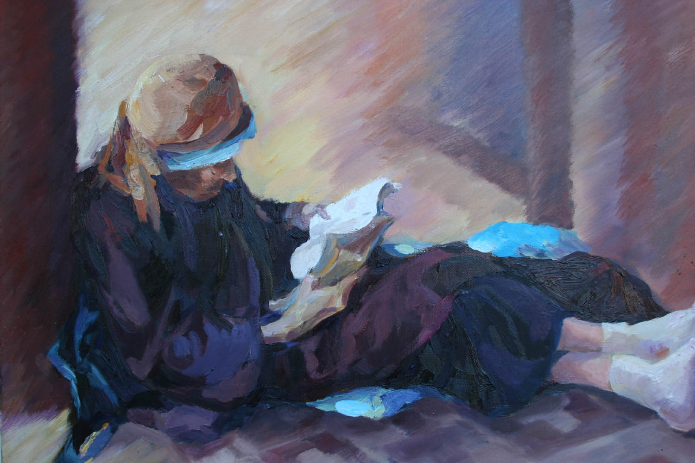

<!DOCTYPE html>
<html lang="en">
<head>
  <meta charset="UTF-8">
  <title>慢鱼的blog</title>
  <link rel="stylesheet" type="text/css" href="main.css">
  <link rel="stylesheet" type="text/css" href="css/font-awesome.min.css">
</head>
<body class="welcome">
  

    

      <ul class="nav">
        <li class="current"><a href="index.html">Blog</a></li>
        <li><a href="">Work</a></li>
        <li><a href="about.html">About</a></li>
      </ul>
    

    <a class="logo" href="index.html">慢鱼</a>
  

  

  

  

    

        

          
          

            <h3> <a href="cpp.html">我为啥放弃了 C++ 的开发工作</a> </h3>
          

          
 2015年1月9号

        

        

          
          

            <h3>
            <a href="post1.html">Learn By Making</a>
            </h3>
          

          

            2014年12月21号
          

        

        

          
          

            <h3>
            <a href="self-media.html">我做自媒体人的这三年</a>
            </h3>
          

          

            2014年12月1号
          

        

        

          
          

            <h3>
            <a href="new-way-out.html">新文学青年的出路</a>
            </h3>
          

          

            2014年1月25号
          

        

        

        

    

  

  

    

      <ul class="icon-wrapper">
        <li class="icon github"><a href="http://github.com/happypeter"> <i class="fa fa-github-alt"></i> </a></li>
        <li class="icon email"><a href="mailto:happypeter1983@gmail.com"><i class="fa fa-envelope-o"></i></a></li>
        <li class="icon weibo"><a href="http://weibo.com/happycasts"><i class="fa fa-weibo"></i></a></li>
      </ul>
    

  

</body>
</html>